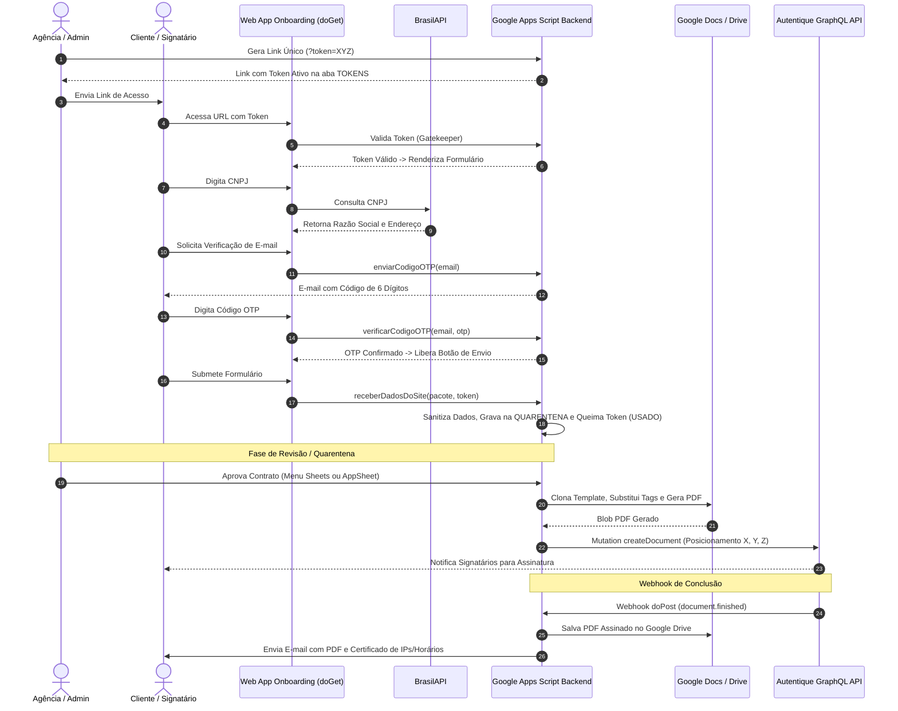

# Estudo de Caso: Automação do Ciclo de Vida de Contratos (CLM) e Assinatura Digital

> **Pipeline end-to-end de onboarding de clientes, validação cadastral (BrasilAPI / OTP), aprovação com quarentena, fusão dinâmica de minutas no Google Docs e integração com Autentique GraphQL API.**

---

## 1. Contexto e Objetivo

O processo tradicional de emissão e assinatura de contratos em agências de serviços digitais frequentemente enfrenta atritos operacionais:
- Digitação manual de dados cadastrais propensa a erros em CNPJ, CPF e endereços;
- Falta de autenticação prévia de e-mails corporativos dos signatários;
- Links de onboarding desprotegidos e suscetíveis a múltiplos envios ou *scraping*;
- Dependência de processos manuais para cópia e substituição de variáveis em minutas;
- Atrasos no acompanhamento do status de assinatura e arquivamento manual das vias assinadas.

Para eliminar essas fricções e criar um fluxo **100% auditável, seguro e automatizado**, foi desenvolvido um **sistema de Contract Lifecycle Management (CLM)** integrado ao ecossistema Google Workspace (Google Apps Script, Google Docs, Drive, Sheets) com frontend Web responsivo e integração direta à API GraphQL da **Autentique**.

---

## 2. Tecnologias e Ferramentas Utilizadas

| Camada / Módulo | Tecnologia | Aplicação no Estudo de Caso |
|---|---|---|
| **Frontend Web** | HTML5, Bootstrap 5, JavaScript Vanilla | Interface de onboarding com validações dinâmicas e proteção de estado |
| **Integração Cadastral** | BrasilAPI (REST) | Autocompletar instantâneo de Razão Social, Logradouro, Bairro e CEP via CNPJ |
| **Validação Algorítmica** | Algoritmo Módulo 11 (CPF) | Validação matemática no cliente dos dois dígitos verificadores do CPF |
| **Autenticação em Duas Etapas** | Sistema OTP (One-Time Password) | Envio e validação de código de 6 dígitos via e-mail antes de liberar o formulário |
| **Backend & Orquestração** | Google Apps Script (V8 Engine) | Endpoints `doGet` (Gatekeeper), `doPost` (Webhook) e funções de negócio |
| **Geração de Documentos** | Google Docs API + Google Drive API | Clonagem de templates, substituição atômica de tags `<<Tag>>` e conversão em PDF |
| **Assinatura Eletrônica** | Autentique GraphQL API v2 | Criação de documentos, posicionamento visual de rubricas/carimbos e despacho aos signatários |
| **Persistência & Quarentena** | Google Sheets Relacional | Controle de tokens, camada de quarentena para aprovação humana e histórico |
| **Integração No-Code** | Google AppSheet | Aprovação remota de contratos via aplicativo mobile |

---

## 3. Arquitetura da Solução e Fluxo Operacional

O pipeline abrange desde a emissão de links de uso único até o arquivamento definitivo com disparo de cópias autenticadas:



---

## 4. Destaques de Engenharia e Segurança

### 4.1 Gatekeeper de Links e Proteção Contra Replay Attacks
- **Tokens de Uso Único (*Single-Use Tokens*):** Cada link gerado contém um token criptográfico aleatório registrado na aba `TOKENS`.
- **Invalidação Atômica:** No momento em que os dados são enviados para a quarentena, o token é marcado como `USADO`. Qualquer tentativa posterior de reabrir a URL resulta em bloqueio imediato na tela de erro do Gatekeeper.

### 4.2 Defesa em Profundidade e Sanitização de Tipos
- **Preservação de Zeros à Esquerda:** Implementação de sanitizador estrito que anexa apóstrofo (`'`) a campos de CNPJ e CPF, impedindo que o Google Sheets interprete strings numéricas como inteiros e corte os zeros iniciais.
- **Proteção contra Injeção de Fórmulas (CSV/Formula Injection):** Sanitização automática de strings que iniciam com caracteres perigosos (`=`, `+`, `-`, `@`), prevenindo execução indevida de macros ou fórmulas arbitrárias.

### 4.3 Sistema de Validação Cadastral e OTP
- **Resolução Automática de CNPJ:** Integração com a **BrasilAPI** eliminando preenchimento manual de logradouro, número, bairro, cidade, UF e CEP.
- **Validação Algorítmica de CPF:** Cálculo vetorial no cliente baseado na regra dos dois dígitos verificadores (Módulo 11), bloqueando o avanço em caso de CPFs inválidos ou sequências repetidas (`111.111.111-11`).
- **One-Time Password (OTP):** Armazenamento de códigos voláteis no `PropertiesService` do Google Apps Script com expiração e deleção instantânea pós-validação.

### 4.4 Camada de Quarentena e Aprovação Humana (*Human-in-the-Loop*)
- Os dados submetidos pelo cliente não geram o contrato na Autentique imediatamente. Eles ingressam na aba `QUARENTENA` com status `AGUARDANDO APROVAÇÃO`.
- A equipe administrativa revisa as informações e dispara a geração através do menu integrado do Google Sheets (`Agência > 2. Aprovar e Enviar Contrato`) ou via ação em background no **Google AppSheet** (`aprovarViaAppSheet(cnpj)`).

### 4.5 Posicionamento Visual Preciso na API GraphQL da Autentique
- O envio do PDF gerado ocorre via requisição multipart GraphQL (`mutation CreateDocumentMutation`), definindo as coordenadas tridimensionais exatas ($X, Y, Z$) das assinaturas do cliente e da agência em páginas contratuais específicas (ex: carimbos de rubricação na página 11 e assinatura formal na página 15):

```json
"signers": [
  {
    "name": "Nome do Representante do Cliente",
    "email": "cliente@empresa.com.br",
    "action": "SIGN",
    "delivery_method": "DELIVERY_METHOD_EMAIL",
    "positions": [
      { "x": 30, "y": 72, "z": 11 },
      { "x": 30, "y": 72, "z": 15 }
    ]
  }
]
```

### 4.6 Webhook Automatizado de Retorno e Arquivamento
- O endpoint `doPost` escuta o evento `document.finished` disparado pela Autentique quando todas as partes concluem a assinatura.
- O script baixa o PDF com certificado de autenticidade (log de IPs, horários e carimbos criptográficos), armazena na pasta designada do Google Drive e despacha uma cópia por e-mail com anexo para todas as partes envolvidas.

---

## 5. Principais Resultados e Métricas

- **Redução do Ciclo de Fechamento:** O tempo médio de emissão e assinatura de contratos caiu de **2 a 3 dias úteis para menos de 15 minutos**.
- **Taxa de Erro Zero em Cadastros:** Eliminação total de devoluções contratuais por divergências de CNPJ, CEP ou erros ortográficos em Razão Social.
- **Auditoria Jurídica Imutável:** Coleta de evidências digitais em conformidade com as diretrizes da ICP-Brasil e legislação brasileira de assinaturas eletrônicas (Lei 14.063/2020).
- **Custo Operacional Otimizado:** Orquestração completa executada sem infraestrutura de servidores dedicados, operando nativamente no ecossistema Google Workspace e Autentique.