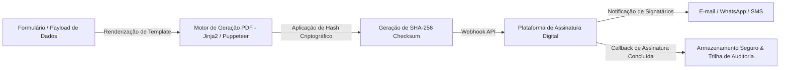

# Sistema de Gestão de Contratos & Assinaturas Digitais

> **Automação de Ciclo de Vida de Contratos (CLM), Geração Dinâmica de Documentos e Integração com Assinatura Eletrônica.**

---

## 1. Visão Geral do Projeto (Estudo de Caso)

Este estudo de caso aborda a criação de um **Gerenciador e Orquestrador de Contratos Digitais (Contract Lifecycle Management)**. O sistema automatiza a emissão de minutas padronizadas, preenchimento dinâmico de variáveis contratuais, validação jurídica prévia e envio automatizado para fluxos de assinatura digital com validade jurídica (ICP-Brasil e padrões internacionais).

A solução reduz o tempo de fechamento de acordos comerciais de dias para minutos, eliminando retrabalho manual e garantindo trilha de auditoria (*audit trail*) imutável.

---

## 2. Fluxo Operacional & Arquitetura

### Principais Recursos:
- **Templates Parametrizáveis:** Criação de modelos reutilizáveis com inserção dinâmica de dados de partes, cláusulas condicionais e valores.
- **Validação Criptográfica:** Geração de carimbo do tempo e hash `SHA-256` para garantia de integridade documental.
- **Disparo Automatizado & Webhooks:** Notificações instantâneas via Telegram/WhatsApp para signatários e atualização de status em tempo real.
- **Auditoria & Conformidade:** Registro completo de logs de visualização, IP, geolocalização aproximada e eventos de assinatura.

---

## 3. Palavras-Chave & Tecnologias (Tech Stack)

| Categoria | Tecnologias / Conceitos |
|---|---|
| **Backend & Automação** | `Python`, `Node.js`, `FastAPI / Express`, `Puppeteer / WeasyPrint` |
| **Segurança & Criptografia** | `SHA-256`, `Assinatura Digital ICP-Brasil`, `Certificados X.509` |
| **Integrações & APIs** | `DocuSign / ClickSign API`, `Webhook Handlers`, `Telegram Bot API` |
| **Armazenamento & Logs** | `PostgreSQL / SQLite`, `S3 Bucket Storage`, `Audit Trail Logging` |
