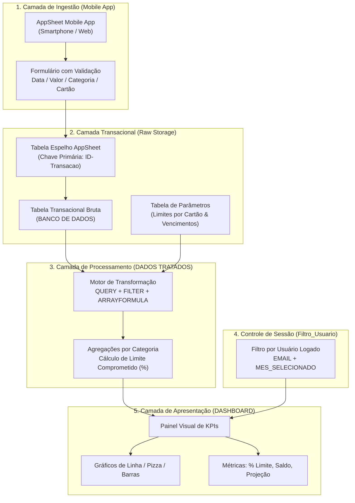

# Estudo de Caso: Arquitetura de Pipeline de Dados, AppSheet e Dashboard Financeiro

> **Engenharia de dados aplicada à gestão financeira: arquitetura em camadas (Input > ETL > Relational Core > Output), integração mobile no-code via Google AppSheet, segurança em nível de linha (RLS) e telemetria de limites em tempo real.**

---

## 1. Contexto e Objetivo

O controle financeiro pessoal e empresarial de despesas com múltiplos cartões de crédito frequentemente sofre com erros de digitação, falta de integridade referencial e lentidão ao lidar com grandes volumes de transações em planilhas convencionais.

Este estudo de caso documenta o projeto e implementação de um **sistema estruturado de gestão financeira e telemetria de gastos** construído sob o paradigma clássico de **Pipeline de Dados desacoplado (Input > Armazenamento > ETL > Apresentação)**:

- **Entrada de Dados Mobile Amigável:** Interface no-code via **Google AppSheet** para inserção de transações no ponto de venda (mobile) com chaves primárias (`ID-Transacao`).
- **Camada de Integridade e Validação:** Menus suspensos dinâmicos e validação estrita de tipos para categorias de despesa e contas de cartão.
- **Camada de ETL (Extract, Transform, Load):** Processamento e agregação automática de dados brutos utilizando funções relacionais (`QUERY`, `FILTER`, `ARRAYFORMULA`, `SOMASE`) para alimentar os gráficos sem afetar o banco transacional.
- **Camada de Visualização & KPIs:** Dashboard analítico interativo para monitoramento de limite comprometido, despesas por centro de custo e comparativos mensais.
- **Segurança em Nível de Linha (Row-Level Security - RLS):** Mecânica de filtragem dinâmica por usuário logado (`EMAIL`) e controle temporal de períodos (`MES_SELECIONADO`).

---

## 2. Tecnologias e Ferramentas Utilizadas

| Camada / Componente | Tecnologia | Aplicação no Estudo de Caso |
|---|---|---|
| **Interface Mobile (Input)** | Google AppSheet (No-Code Engine) | Captura de despesas no smartphone com geração de UUIDs e sincronização em background |
| **Banco de Dados Transacional** | Google Sheets Relacional / AppSheet Tables | Armazenamento estruturado de transações brutas e limites cadastrados |
| **Camada de ETL & Agregação** | Funções Avançadas (`QUERY`, `FILTER`, `SUMIF`) | Normalização, enriquecimento, agregações por categoria e cálculo de comprometimento |
| **Visualização & BI (Output)** | Dashboard Nativo / Looker Studio | Painel visual com indicadores de desempenho (KPIs) e gráficos de distribuição |
| **Segurança & Controle de Acesso** | Row-Level Security (RLS) | Filtros dinâmicos baseados no e-mail do usuário logado e períodos fiscais |

---

## 3. Arquitetura da Solução e Fluxo de Dados

A arquitetura adota a separação estrita de responsabilidades em 4 camadas independentes, garantindo integridade de dados, alta escalabilidade e proteção contra edições acidentais:

---

## 4. Engenharia das Camadas do Sistema

### 4.1 Ingestão Mobile e Integridade de Dados (`AppSheet` / `BANCO DE DADOS`)
- **Geração de Chave Primária:** Cada lançamento submetido no aplicativo recebe um identificador único (`ID-Transacao`), prevenindo duplicidades em requisições concorrentes ou sincronizações offline.
- **Validação Estrita de Domínio:** Seletores dropdown garantem que os campos *Motivo* e *Cartão* sigam rigorosamente a taxonomia cadastrada, eliminando variações de escrita (*typos*) que quebram agregações de BI.

### 4.2 Camada de Transformação e Agregação (`DADOS TRATADOS`)
- **Isolamento de Carga:** Os cálculos analíticos não são executados sobre a visualização do usuário, mas em uma aba intermediária de ETL.
- **Cálculo de Comprometimento de Limite:** Fórmulas dinâmicas cruzam em tempo real o somatório de gastos vigentes de cada cartão com a tabela de limites cadastrados:
  $$\text{Comprometimento (\%)} = \left( \frac{\sum \text{Gastos do Cartão no Mês}}{\text{Limite Total do Cartão}} \right) \times 100$$

### 4.3 Segurança e Filtragem em Nível de Linha (`Filtro_Usuario`)
- **Isolamento Multi-Tenant:** A estrutura é preparada para exibir apenas as informações pertinentes ao usuário autenticado, cruzando a variável de sessão `EMAIL` com os registros associados.
- **Seleção de Período Paramétrico:** O parâmetro `MES_SELECIONADO` altera instantaneamente todo o escopo de datas do dashboard sem necessidade de filtros manuais complexos em cada gráfico.

### 4.4 Apresentação e Painel Executivo (`DASHBOARD`)
- **KPIs em Destaque:** Total de gastos acumulados no mês, percentual médio de comprometimento de crédito, maior categoria de despesa e projeção de fechamento de fatura.
- **Visualização Gráfica:** Gráficos de barras para distribuição por categoria, linhas temporais de evolução de gastos e barras de progresso para a saúde de limite de cada cartão.

---

## 5. Principais Resultados e Benefícios

- **Facilidade e Adoção:** Registro de despesas em menos de 10 segundos diretamente pelo celular no momento da compra.
- **Integridade Absoluta:** Eliminação de erros manuais e discrepâncias de fechamento de faturas.
- **Performance e Escalabilidade:** Separação entre dados transacionais e cálculos analíticos, mantendo a planilha ágil mesmo com milhares de registros.
- **Visibilidade Financeira em Tempo Real:** Alertas visuais antes de atingir faixas críticas de comprometimento de limite nos cartões de crédito.