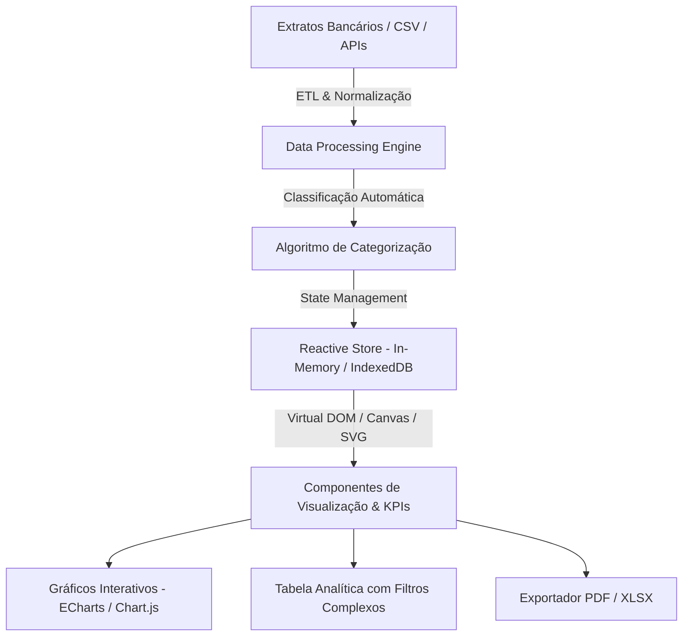

# Dashboard Financeiro & Gestão de Despesas em Tempo Real

> **Plataforma Web Modular para Análise Preditiva, Telemetria de Custos e Visualização de Dados de Alta Performance.**

---

## 1. Visão Geral do Projeto (Estudo de Caso)

Este projeto apresenta um **Dashboard Financeiro Interativo** desenhado para consolidação, classificação e visualização de fluxos de caixa e despesas operacionais. A arquitetura foi concebida sob os pilares de **baixa latência de renderização**, visualização intuitiva com gráficos dinâmicos e exportação de relatórios analíticos.

A interface disponibiliza KPIs instantâneos, categorização preditiva de gastos e simulação de cenários orçamentários, operando com total privacidade e persistência de dados local/nuvem.

---

## 2. Arquitetura da Aplicação

### Funcionalidades Centrais:
- **Métricas e KPIs em Tempo Real:** Acompanhamento dinâmico de despesas fixas, variáveis, margens de economia e projeções mensais.
- **Categorização Inteligente:** Regras heurísticas de classificação automática por padrões de descrição de despesas.
- **Desempenho Otimizado:** Virtualização de listas para renderização instantânea de milhares de lançamentos sem engasgos no DOM.
- **Segurança e Privacidade:** Processamento dos dados localmente no cliente (Client-Side Encryption) sem vazamento de dados sensíveis para servidores terceiros.

---

## 3. Palavras-Chave & Tecnologias (Tech Stack)

| Categoria | Tecnologias / Conceitos |
|---|---|
| **Front-End & UI** | `Vanilla ES6+`, `CSS Grid/Flexbox`, `M3 Theming`, `SVG Charts` |
| **Visualização de Dados** | `ECharts / Chart.js`, `D3.js Concepts`, `Responsive Data Viz` |
| **Processamento & Dados** | `IndexedDB`, `LocalStorage Engine`, `CSV Parser`, `Data Virtualization` |
| **Relatórios & Exportação** | `PDFKit`, `SheetJS (XLSX Export)`, `Analytics Pipeline` |
