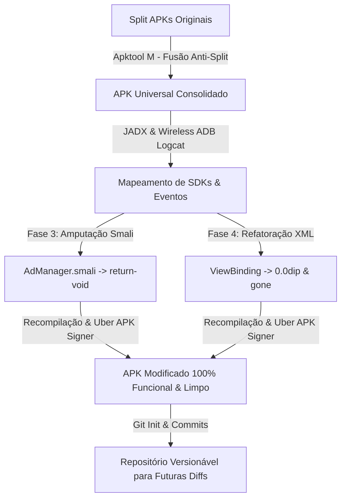

# Engenharia Reversa, Remoção de Adware e Manipulação de UI em Aplicativo Android IoT

> **Erradicação de Mediação Autônoma de Anúncios, Refatoração de ViewBinding com Técnica 0.0dip e Fusão de Split APKs para Pacote Universal.**

---

## 1. Contexto e Objetivo

O alvo do estudo foi um aplicativo Android de monitoramento de câmeras IoT (identificado como **V380/Cloudbirds**), distribuído sob a arquitetura de **App Bundle (Split APKs)**. O objetivo central foi a erradicação completa de anúncios de terceiros (redes de publicidade) e a ocultação de elementos intrusivos de monetização primária (*1st-party upsell* de armazenamento em nuvem), sem comprometer a estabilidade do ViewBinding ou a comunicação com os servidores de validação de vídeo.

---

## 2. Tecnologias e Ferramentas Utilizadas

| Ferramenta / Tecnologia | Aplicação no Estudo de Caso |
|---|---|
| **Apktool** | Descompilação e recompilação do bytecode (Smali) e recursos XML |
| **JADX** | Descompilação do APK para código Java/Kotlin legível para busca de strings, referências e mapeamento de Hex IDs |
| **Uber APK Signer** | Assinatura de pacotes V1/V2/V3 para permitir a instalação sideload de apps modificados |
| **Android Debug Bridge (ADB)** | Instalação de pacotes múltiplos (`install-multiple`), captura de logs em tempo real (`Logcat`) e conexão Wireless ADB para contornar instabilidade de hardware (loops de negociação de energia via cabo USB) |
| **Apktool M (Maximoff)** | Fusão de Split APKs (Anti-Split) diretamente no dispositivo Android para gerar um APK Universal |
| **Git** | Versionamento de código da arquitetura unificada e rastreamento de diffs estruturais |
| **VS Code** | Edição de código Smali e XML |

---

## 3. Metodologia e Fases do Desenvolvimento

### Fase 1: Bypass de Configuração (O Falso Positivo)
- **Lógica:** A análise inicial identificou uma classe de configuração (`AppSettingSp`) responsável por ditar as regras de exibição de anúncios. A modificação via Smali forçou o retorno de valores nulos/falsos (ex: `isBanner: 0`, `isNative: 0`).
- **Análise de Falha:** A hipótese de que o aplicativo respeitaria seu próprio painel de controle provou-se frágil. Embora a UI nativa tenha suprimido chamadas diretas, SDKs de terceiros agressivos (TradPlus, Pangle/TikTok, Mintegral, AppLovin) possuíam fluxos de inicialização independentes que ignoravam o `AppSettingSp` e executavam cache de mídia em segundo plano (Cold Start e Interstitials no evento `onBackPressed`).

### Fase 2: Interceptação Dinâmica via Logcat
- **Lógica:** Com a falha da Fase 1, utilizou-se o Logcat via Wireless ADB (para mitigar a desconexão física) com o objetivo de capturar a impressão digital do evento de anúncio em tempo real.
- **Execução:** A captura isolou IDs de evento (ex: `69e8078f3...`) e revelou a cadeia de invocação: o `YdSDK` estava solicitando regras diretamente ao seu servidor (`medproad.com`) e usando o `TradPlusInterstitialAdapter` para forçar a renderização do Mintegral na tela.

### Fase 3: A Opção Nuclear (Amputação no Smali)
- **Lógica:** Uma vez que a biblioteca provou ser uma "caixa preta" autônoma, a solução não era modificar o que ela exibia, mas impedir sua alocação em memória.
- **Execução:** Localizou-se a classe despachante (`AdManager.smali`). Os métodos `initAd` e `setAdConfig` tiveram seu conteúdo esvaziado e substituído unicamente pela instrução `return-void`.
- **Resultado:** O aplicativo tentava inicializar a biblioteca, mas o comando caía em um vazio lógico. Sem inicialização, os SDKs não conseguiam acesso à rede nem ganchos de ciclo de vida (*lifecycle hooks*). Os anúncios externos cessaram imediatamente.

### Fase 4: Manipulação de UI Nativa (A Técnica do "Buraco Negro" via XML)
- **Lógica:** O aplicativo ainda exibia pop-ups intrusivos e listas expansíveis oferecendo assinaturas de nuvem ("Today's Key Events", balões de Upgrade).
- **Avaliação de Risco (Fragilidade Evitada):** A alteração da variável `isVip()` para `true` foi descartada. Em sistemas IoT baseados em token, forçar o status VIP no cliente gera uma divergência de estado com o servidor, resultando na negação do feed de vídeo (quebra do app).
- **Execução:** Optou-se por atacar exclusivamente a View (camada de apresentação).
  1. **Rastreio:** Utilizou-se o pacote `pt.apk` e a descompilação Java para mapear o texto para seu respectivo Hex ID (ex: `0x7f12085f`) no `public.xml`.
  2. **Identificação:** A busca pelo Hex ID no Smali revelou as classes de Binding (ex: `NewsSummaryDetailActivityBinding`).
  3. **Modificação XML:** Em vez de apagar as tags XML (o que causaria um `NullPointerException` devido à checagem estrita do ViewBinding no Java), os contêineres pai (Layouts) e filhos (TextViews, Buttons) tiveram seus parâmetros `android:layout_width` e `android:layout_height` alterados para `0.0dip`, e `android:visibility` para `"gone"`.
- **Resultado:** O aplicativo ainda processava a lógica, vinculava os elementos e inseria o texto, mas a interface renderizava o componente com zero pixels de área geométrica, tornando as propagandas inexistentes na tela.

### Fase 5: Reestruturação de Arquitetura (Anti-Split e Controle de Versão)
- **Lógica:** Manter 4 pacotes separados (Base, ARM64, PT, XXHDPI) dificultava a manutenção, impedia a edição direta de recursos de localização (strings) e fragmentava o controle de versão.
- **Execução:**
  1. Utilizou-se o **Apktool M** no dispositivo para realizar a fusão (*Merge*) dos pacotes instalados em um **APK Universal**.
  2. O APK Universal foi descompilado no PC, consolidando Smali, bibliotecas SO, e todas as pastas de valores e layouts em um único repositório limpo.
  3. Inicialização do Git no diretório consolidado, permitindo que futuras atualizações do app possam ser mapeadas através de diffs, registrando com exatidão as alterações estruturais realizadas em XML e Smali.

---

## 4. Conclusão e Avaliação Crítica

O projeto demonstrou que a engenharia reversa moderna de aplicativos Android exige resiliência contra arquiteturas de publicidade baseadas em mediação autônoma. Tentar desativar flags booleanas é frequentemente ineficaz contra SDKs agressivos. A abordagem em duas frentes — **amputação letal (`return-void`) para código de terceiros** e **refatoração geométrica (`0.0dip`) para código proprietário sob ViewBinding** — mostrou-se a estratégia mais estável e definitiva. A consolidação final para APK Universal transformou um hack temporário em uma base de código versionável e sustentável.