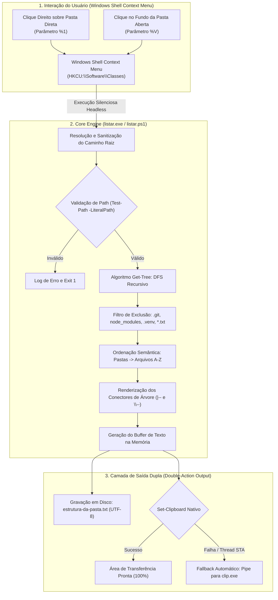
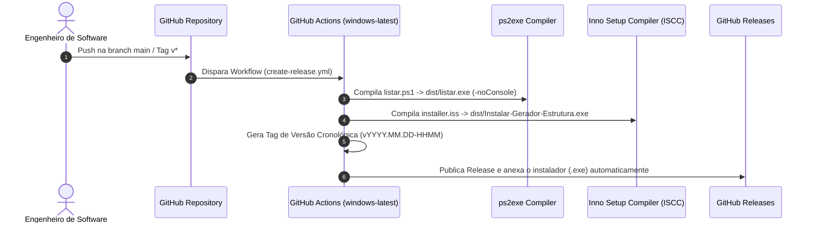

# Estudo de Caso: Gerador de Estrutura de Pastas — Automação de Shell Windows, Empacotamento Binário & CI/CD

> **Utilitário de sistema e extensão do Windows Explorer para extração instantânea de topologias de diretórios com filtragem inteligente de ruídos (`.git`, `node_modules`, `.venv`), persistência UTF-8 em disco, fallback duplo na área de transferência (*Clipboard*), compilação de binários nativos (`ps2exe`), instalador autônomo (*Inno Setup*) e pipeline de release contínua no GitHub Actions.**  
> **Repositório GitHub:** [github.com/luccascomvoce/retorna_nomes_arquivos_pastas](https://github.com/luccascomvoce/retorna_nomes_arquivos_pastas)

---

## 1. Contexto e Objetivo

No fluxo diário de desenvolvimento de software, documentar a arquitetura de pastas de um repositório é uma tarefa essencial para:
- **Documentação de Repositórios (`README.md`):** Exibir diagramas em árvore claros da organização modular.
- **Engenharia de Prompt para IA / LLMs:** Fornecer a topologia exata de arquivos para alimentar o contexto de modelos como Gemini, GPT e Claude sem estourar janelas de contexto com pastas gigantes de dependências.
- **Code Reviews e Pull Requests:** Contextualizar revisores sobre a criação e movimentação de pacotes e módulos.
- **Onboarding Técnico:** Acelerar o entendimento de novos engenheiros sobre a estrutura de microserviços e monorepos.

### Limitações das Ferramentas Nativas Tradicionais:
1. **Comando `tree` nativo do Windows:** Não suporta exclusões condicionais dinâmicas, gerando saídas poluídas com milhares de linhas de bibliotecas externas (`node_modules`, `.venv`) ou metadados de versionamento (`.git`).
2. **Scripts manuais repetitivos:** Exigem copiar e colar arquivos `.ps1` ou `.py` dentro de cada repositório, poluindo o *working tree* do Git.
3. **Barreiras de Privilégio (UAC/Admin):** Utilitários que exigem instalação no escopo de máquina (`HKLM`) são frequentemente bloqueados por políticas de segurança corporativas.

> 💡 **TL;DR & A Arte da Superengenharia:**  
> *"Faz exatamente o mesmo que `$txt = tree /f /a; $txt | Out-File -Encoding utf8 .\estrutura-da-pasta.txt; $txt | Set-Clipboard`, só que com o suprassumo da superengenharia via menu de contexto do Windows Explorer com 1 clique — porque lembrar de comandos de terminal com flags de encoding é opcional."*

O **Gerador de Estrutura de Pastas** foi projetado para eliminar completamente esse atrito: com um único clique com o botão direito em qualquer pasta do Windows Explorer, a ferramenta gera uma árvore de texto perfeitamente formatada, grava um arquivo `estrutura-da-pasta.txt` em UTF-8 e copia o resultado diretamente para o *Clipboard* do sistema operacional.

---

## 2. Tecnologias e Ferramentas Utilizadas

| Camada / Componente | Tecnologia | Papel no Projeto |
|---|---|---|
| **Core Engine & Scripting** | PowerShell 5.1 & Core (`pwsh`), Windows Batch (`.cmd`) | Algoritmo DFS recursivo de varredura, ordenação semântica e filtragem de ruído |
| **Integração com o Sistema** | Windows Registry API (`HKEY_CURRENT_USER`), Shell Extensions | Registro nos nós `Directory\shell` e `Directory\Background\shell` sem privilégios de Admin |
| **Área de Transferência** | `Set-Clipboard` (Nativo) + `clip.exe` (Fallback em streaming) | Estratégia de saída resiliente em duas camadas para a área de transferência do Windows |
| **Compilação de Binários** | `ps2exe` | Transpilação do script PowerShell para executável Windows nativo (`listar.exe`) sem janela de console |
| **Engenharia de Instalação** | Inno Setup 6 (Pascal Scripting) | Assistente gráfico de instalação, detecção de versões legadas e limpeza total na desinstalação |
| **DevOps & CI/CD** | GitHub Actions (`windows-latest`) | Compilação automatizada, empacotamento, versionamento cronológico e publicação de Releases |

---

## 3. Arquitetura do Sistema e Fluxo de Execução

A arquitetura opera sob o princípio de **privilégio mínimo (*Least Privilege*)**, **zero dependência em runtime** e **saída dupla resiliente**:



---

## 4. Detalhamento Algorítmico e Decisões de Implementação

### 4.1. Algoritmo de Varredura e Renderização Hierárquica (`Get-Tree`)
A árvore é percorrida usando um algoritmo recursivo de busca em profundidade (*Depth-First Search - DFS*):

* **Tratamento de Caminhos Seguros:** Uso estrito do parâmetro `-LiteralPath` em cmdlets como `Get-ChildItem` e `Test-Path`, garantindo que diretórios com caracteres especiais ou colchetes (ex.: `[Draft]`, espaços e símbolos) sejam lidos sem falhas de interpretação de regex.
* **Ordenação Semântica:** O algoritmo agrupa e prioriza diretórios no topo, seguidos por arquivos em ordem alfabética:
  ```powershell
  Sort-Object @{ Expression = { -not $_.PSIsContainer } }, Name
  ```
* **Conectores Visuais Determinísticos:** O algoritmo calcula o total de itens no nível corrente para alternar entre conectores intermediários (`|-- `) e o conector de encerramento (`\-- `), mantendo a indentação visual intacta:
  ```powershell
  if ($currentItem -eq $totalItems) {
      $connector = "\-- "
      $newPrefix = $Prefix + "    "
  } else {
      $connector = "|-- "
      $newPrefix = $Prefix + "|   "
  }
  ```

### 4.2. Filtragem de Ruído em Tempo de Execução (*Noise Reduction*)
O mecanismo de exclusão combina itens estáticos configuráveis e identificadores dinâmicos calculados em tempo de execução:
* **Pastas de Dependências & Versionamento:** `.venv`, `node_modules`, `.git`, `.idea`, `.vscode`.
* **Auto-Exclusão Dinâmica:** O próprio script em execução (`$MyInvocation.MyCommand.Name`) e o arquivo de saída gerado (`estrutura-da-pasta.txt`) são automaticamente ignorados, prevenindo auto-referência em execuções sucessivas.

### 4.3. Estratégia de Fallback Resiliente na Área de Transferência
A ferramenta atende simultaneamente dois fluxos de consumo de informação:
1. **Persistência Local:** Gravação direta no diretório-alvo com codificação `UTF-8` explícita, prevenindo perda de acentuação e caracteres Unicode.
2. **Clipboard em Duas Camadas:**
   * *Nível 1:* Tenta o cmdlet nativo `Set-Clipboard`.
   * *Nível 2 (Fallback Graceful):* Caso o host do PowerShell esteja operando fora de uma thread STA ou encontre bloqueios de concorrência na área de transferência, redireciona o fluxo para o executável `clip.exe` nativo do Windows via pipeline de bytes.

---

## 5. Integração com o Windows Shell & Registro do Sistema

### 5.1. Mapeamento de Chaves de Registro (`HKCU`)
Toda a integração com o Windows Explorer é realizada sob a colmeia `HKEY_CURRENT_USER\Software\Classes`, dispensando permissões de Administrador (*UAC*):

1. **Clique sobre uma Pasta Selecionada:**
   * Chave: `HKCU:\Software\Classes\Directory\shell\GerarEstrutura`
   * Comando: Invocação do binário com o parâmetro `%1` (caminho absoluto da pasta).
2. **Clique na Área Vazia de uma Pasta Aberta:**
   * Chave: `HKCU:\Software\Classes\Directory\Background\shell\GerarEstrutura`
   * Comando: Invocação do binário com o parâmetro `%V` (caminho do diretório ativo no Explorer).

### 5.2. Execução Headless Silenciosa
Para eliminar janelas de terminal piscando na tela (*console flickering*), a integração utiliza compilação nativa com a flag `-noConsole` via `ps2exe` e diretivas `-WindowStyle Hidden`.

---

## 6. Pipeline DevOps, Empacotamento e CI/CD



### 6.1. Assistente de Instalação com Inno Setup (`installer.iss`)
* **Instalação sem Elevação (`PrivilegesRequired=lowest`):** Compatibilidade integral com contas de usuário corporativas e sem privilégios de root.
* **Ciclo de Vida Limpo (`uninsdeletekey`):** Desinstalação completa que remove 100% das chaves do registro sem deixar lixo no sistema.
* **Detecção Inteligente de Versões Legadas:** Código em Pascal (`[Code] -> InitializeSetup()`) que consulta o registro de desinstalação do Windows e oferece ao usuário a opção de remover versões anteriores de forma limpa e silenciosa antes da instalação.

---

## 7. Resultados e Impacto (*Engineering & Business Value*)

- **Redução Drástica de Fricção:** O tempo para mapear e documentar a topologia de um projeto foi reduzido de vários minutos para **menos de 1 segundo** (um clique).
- **Otimização de Contexto para LLMs:** Geração de diagramas compactos e sem ruídos, economizando milhares de tokens em requisições para IAs generativas.
- **Zero Overhead de Configuração:** Instalação em dois cliques, sem necessidade de configurar `PATH`, instalar runtimes externos ou alterar políticas de execução do sistema.

---

## 8. Matriz de Competências Técnicas

- **Linguagens & Scripting:** PowerShell Scripting (5.1 / pwsh), Windows Batch Scripting (`.cmd`), Pascal Scripting (Inno Setup).
- **Engenharia de Sistemas Windows:** Windows Registry Architecture (`HKCU`), Windows Explorer Shell Extensions, Shell Parameter Expansion (`%1` vs `%V`), System Clipboard Automation (`Set-Clipboard`, `clip.exe`).
- **Estrutura de Dados & Algoritmos:** Depth-First Search (DFS), Recursão em Árvores de Diretórios, Algoritmos de Ordenação, Formatação de Layout de Árvores, Filtragem Dinâmica.
- **DevOps, Build & Release:** CI/CD Pipelines, GitHub Actions Workflow Orchestration, Inno Setup Compiler (`ISCC`), `ps2exe` Compilation, Continuous Delivery, Versionamento Semântico.