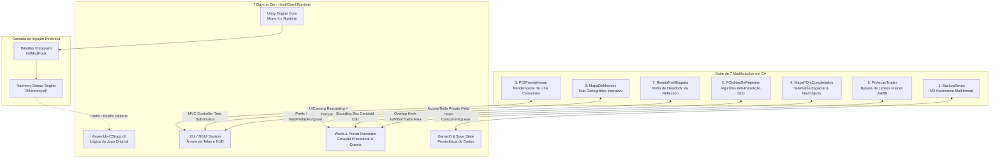
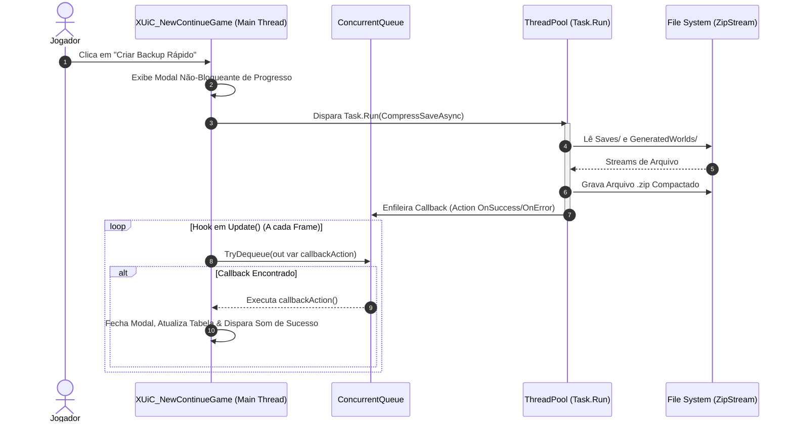
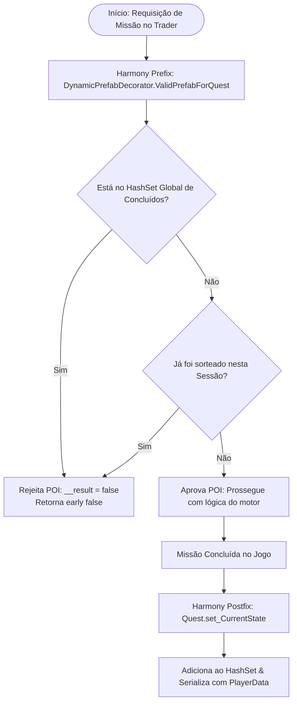
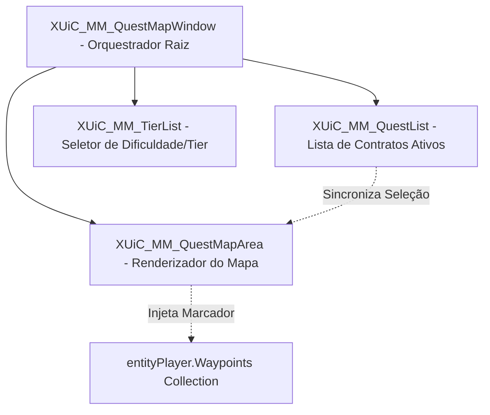
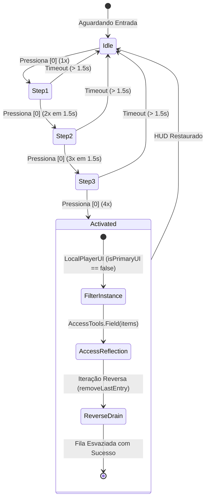

# Estudo de Caso: Engenharia de Software e Modding Avançado em C# para 7 Days to Die

> **Suíte de 7 Modificações em C# (.NET Framework 4.8 / Unity Engine) com injeção dinâmica de bytecode via Harmony, interceptação de interface XUi/NGUI, concorrência não-bloqueante e otimização de estruturas de dados.**  
> **Domínio:** Engenharia Reversa, Arquitetura de Jogos, Otimização de Performance e UI/UX.

---

## 1. Contexto e Objetivo

O desenvolvimento de modificações (*mods*) para jogos construídos sobre a **Unity Engine** exige muito mais do que ajustes superficiais em arquivos de configuração ou parâmetros numéricos. Exige um entendimento profundo de **engenharia reversa**, manipulação de bytecode em tempo de execução (*runtime patching*), arquitetura de sistemas concorrentes, manipulação de grafos de interface (UI) e otimização de estruturas de dados de baixa complexidade.

Este estudo de caso documenta o projeto e implementação de uma **suíte modular de 7 modificações de alta performance** para o jogo de sobrevivência e simulação voxel **7 Days to Die (The Fun Pimps)**. 

### Objetivos Centrais do Projeto:
- **Resolução de Gargalos Críticos de Usabilidade (Quality of Life - QoL):** Eliminar fricções de navegação em diálogos, prover feedback visual antecipado de missões e integrar telemetria cartográfica de exploração.
- **Concorrência e Prevenção de Frame Drops:** Implementar processamento I/O assíncrono desacoplado da *Main Thread* da Unity para compressão e restauração de mundos massivos (*savegames*).
- **Consistência de Estado e Otimização Algorítmica:** Reduzir a complexidade de busca e sorteio de missões para **O(1)** com eliminação total de repetições (*grind* indesejado).
- **Resiliência de Interface e Recuperação de Falhas:** Prover rotinas de recuperação em tempo de execução (*failsafes*) e injeção cirúrgica de *patches* via reflexão para contornar *deadlocks* nativos do motor.

---

## 2. Tecnologias e Ferramentas Utilizadas

| Camada / Ferramenta | Tecnologia | Aplicação no Estudo de Caso |
|---|---|---|
| **Linguagem & Runtime** | C# / .NET Framework 4.8 (Mono) | Desenvolvimento de código gerenciado, tipagem estática e interoperabilidade |
| **Engine & Ecossistema** | Unity Engine (C# Scripting Backend) | Manipulação do ciclo de vida de entidades, objetos de mundo e Coroutines |
| **Injeção de Bytecode** | Harmony (0Harmony.dll) | Prefix, Postfix e Transpiler Detours em métodos de `Assembly-CSharp.dll` |
| **Framework de UI** | XUi / NGUI (Proprietário 7DTD) | Criação e injeção de novos controladores, telas dinâmicas e raycasting |
| **Engenharia Reversa** | dnSpy / JetBrains dotPeek / ILSpy | Descompilação de assemblies, análise de fluxos de controle e mapeamento de campos privados |
| **I/O & Concorrência** | `System.Threading.Tasks`, `ConcurrentQueue` | Processamento assíncrono de arquivos e despacho *thread-safe* para a *Main Thread* |
| **Compressão de Dados** | `System.IO.Compression` (`ZipFile`, `ZipArchive`) | Empacotamento de dados volumosos de mundo e mapas de altura procedurais |
| **Reflexão Avançada** | `System.Reflection`, Harmony `AccessTools` | Acesso e manipulação atômica de estruturas de dados internas não-públicas |

---

## 3. Arquitetura da Solução e Fluxo de Injeção

A base do *7 Days to Die* compila sua lógica central na biblioteca `Assembly-CSharp.dll`. Para injetar novas funcionalidades mantendo **100% de compatibilidade** com versões do jogo e sem corromper binários em disco, a arquitetura opera através do ponto de entrada `IModApi` combinada com *patches* do **Harmony**:



---

## 4. Análise Aprofundada dos Módulos Desenvolvidos

---

### 4.1 Sistema Assíncrono de Backup e Restauração de Saves (`7DTD_MOD_BackupSaves`)

#### O Problema
Em jogos voxel de mundo aberto, dados de terreno procedural (`GeneratedWorlds/`) e estados de entidades (`Saves/`) podem atingir dezenas de gigabytes. Falhas de energia, erros de geração procedural ou testes de mods instáveis provocam corrupção catastrófica de *saves*. O jogo original não fornecia mecanismos de criação de pontos de restauração sem sair da aplicação.

#### A Solução Arquitetural
Criação de um subsistema desacoplado integrado diretamente à tela de seleção de jogos (`XUiC_NewContinueGame`). O módulo executa a compressão e restauração em *threads* secundárias de background, comunicando-se com a *Main Thread* da Unity através de uma fila concorrente *thread-safe*.



#### Detalhes de Implementação e Código C#
- **Isolamento de Concorrência:** O processamento na *thread pool* evita o congelamento (*hitch/freeze*) da taxa de quadros (FPS) da Unity.
- **Consumo Thread-Safe:** O hook no método `Update()` da janela consome a fila com `ConcurrentQueue<Action>.TryDequeue()`.

```csharp
// Padrão de despacho Thread-Safe para a Main Thread da Unity
private static readonly ConcurrentQueue<Action> _mainThreadQueue = new ConcurrentQueue<Action>();

public static void EnqueueMainThread(Action action)
{
    _mainThreadQueue.Enqueue(action);
}

// Injetado via Harmony Patch no Update() da janela XUi
public static void ProcessQueue()
{
    while (_mainThreadQueue.TryDequeue(out var action))
    {
        try { action?.Invoke(); }
        catch (Exception ex) { Log.Error($"[BackupSaves] Erro no callback: {ex}"); }
    }
}
```

---

### 4.2 Algoritmo de Anti-Repetição Global e de Sessão de POIs (`7DTD_MOD_POIsNaoSeRepetem`)

#### O Problema
O algoritmo original de distribuição de missões frequentemente designava o jogador repetidas vezes para o mesmo Ponto de Interesse (POI). Essa redundância quebrava a economia de jogo, induzia à monotonia (*grind*) e desestimulava a exploração do mapa.

#### A Solução Arquitetural
Implementação de um filtro de dois estágios:
1. **Filtro de Sessão em Memória:** Impede repetições na mesma rodada de oferta do comerciante (*trader*).
2. **Lista de Bloqueio Persistente Global:** Armazena os POIs já concluídos no *savegame* do jogador com busca instantânea **O(1)** via `HashSet<string>`.



#### Detalhes de Implementação e Código C#
- **Detour com Curto-Circuito:** Ao interceptar `ValidPrefabForQuest`, a atribuição `ref bool __result = false` encerra a verificação imediatamente, poupando processamento de *pathfinding* e cálculo de distância tridimensional.

```csharp
[HarmonyPatch(typeof(DynamicPrefabDecorator), nameof(DynamicPrefabDecorator.ValidPrefabForQuest))]
public static class ValidPrefabForQuest_Patch
{
    public static bool Prefix(PrefabLocation _prefab, ref bool __result)
    {
        if (_prefab == null) return true;

        string poiId = $"{_prefab.location.x}_{_prefab.location.z}_{_prefab.prefab.Name}";

        // Consulta de alta performance O(1)
        if (GlobalQuestBlockList.IsCompleted(poiId) || SessionTracker.IsUsedThisSession(poiId))
        {
            __result = false;
            return false; // Ignora o método nativo, rejeitando o POI instantaneamente
        }

        return true; // POI válido, prossegue execução
    }
}
```

---

### 4.3 Renderizador de Pré-Visualização de POI em Tempo Real (`7DTD_MOD_POIPreviaMissao`)

#### O Problema
Ao interagir com o comerciante (*trader*), a lista de missões disponíveis exibe apenas nomes e *tiers* de dificuldade (ex: *"Tier 4 - Fetch/Clear"*). O jogador não possuía nenhum indicador visual prévio da arquitetura da edificação.

#### A Solução Arquitetural
Criação de um visualizador gráfico dinâmico desacoplado. O módulo monitora eventos de sobreposição de cursor (*hover*) nos elementos de diálogo, mapeia o ID interno do prefab e carrega a captura em alta resolução da estrutura sob demanda via *Coroutines* da Unity.


#### Detalhes de Implementação
- **UI Picking em Tempo Real:** Leitura de `UICamera.hoveredObject` no ciclo `Update()` do diálogo para determinar a seleção ativa sem criar *listeners* adicionais.
- **Gestão Rigorosa de Memória:** Destruição explícita via `UnityEngine.Object.Destroy(texture)` ao fechar a janela para impedir vazamentos de memória (*memory leaks*) na VRAM.

---

### 4.4 Telemetria Cartográfica de Estruturas Concluídas (`7DTD_MOD_MapaPOIsCompletados`)

#### O Problema
Em mapas extensos (ex: 8.192 x 8.192 blocos), o jogador perde o histórico visual de quais vilarejos, bairros e prédios já foram explorados e saqueados.

#### A Solução Arquitetural
Subsistema de telemetria espacial que intercepta a entrega da missão, extrai as coordenadas de delimitação (*Bounding Box*) do POI, calcula o centroide geométrico tridimensional e injeta marcadores permanentes no subsistema de navegação (`NavObjectManager`).

$$\text{Centroide}_X = X_{\text{canto}} + \frac{\text{Largura}}{2}, \quad \text{Centroide}_Z = Z_{\text{canto}} + \frac{\text{Comprimento}}{2}$$

```
┌─────────────────────────────────────────────────────────┐
│ POI Bounding Box (Prefab):                              │
│ Canto Mínimo: (X_min, Y_min, Z_min)                     │
│ Dimensões:    (Largura = W, Altura = H, Comprimento = L)│
│                                                         │
│                    Centroide Vetorial:                  │
│               X_c = X_min + (W / 2.0f)                  │
│               Z_c = Z_min + (L / 2.0f)                  │
│                           📍                            │
│                  [Marcador de Concluído]                │
└─────────────────────────────────────────────────────────┘
```

---

### 4.5 Hub Centralizado e Interface Gráfica de Missões (`7DTD_MOD_MapaDeMissoes`)

#### O Problema
A navegação e escolha de missões no jogo original ocorria exclusivamente através de listas verticais de diálogos de texto, sem qualquer contexto de geolocalização, distância em relação à base ou proximidade entre diferentes contratos.

#### A Solução Arquitetural
Substituição do fluxo legado por uma janela modal cartográfica integrada (`XUiC_MM_QuestMapWindow`), que plota os marcadores de missões em tempo real diretamente sobre o mapa da região com *waypoints* interativos `(TQ)`.



- **Arquitetura MVC:** Separação entre os dados de contratos (Model), as janelas XUi (View) e os manipuladores de eventos de clique/hover (Controller).
- **Gestão de Waypoints Temporários:** Injeção de instâncias temporárias de `Waypoint` decoradas com tags específicas, com limpeza automática ao aceitar ou recusar missões.

---

### 4.6 Desativação de Restrições em Zonas de Comerciantes (`7DTD_MOD_ProtecaoTrader`)

#### O Problema
As bases de comerciantes possuem zonas de proteção estritas de blocos que impedem qualquer tipo de construção, destruição ou personalização de terreno, inviabilizando bases compartilhadas, cenários de RPG e modificações urbanísticas.

#### A Solução Arquitetural
Injeção de *patches* de sobreposição cirúrgicos cobrindo todas as sobrecargas de validação física e espacial na classe `World`:
- `World.IsWithinTraderArea(Vector3i)`
- `World.IsWithinTraderArea(Vector3i, Vector3i)`
- `World.IsWithinTraderPlacingProtection(Vector3i)`
- `World.IsWithinTraderPlacingProtection(Bounds)` (Axis-Aligned Bounding Box - AABB)

```csharp
[HarmonyPatch(typeof(World), nameof(World.IsWithinTraderArea), new Type[] { typeof(Vector3i) })]
public static class World_IsWithinTraderArea_Patch
{
    public static void Postfix(ref bool __result)
    {
        // Força resultado falso com custo computacional desprezível
        __result = false;
    }
}
```

---

### 4.7 Hotfix de Limpeza de Fila de Notificações e Desincronização de HUD (`7DTD_MOD_ResetaNotifBugada`)

#### O Problema
Uma falha recorrente no motor de UI (`HUDRightStatBars`) causa o travamento permanente de notificações de itens coletados. A pilha interna de animações entra em *deadlock*, deixando caixas de texto congeladas na tela indefinidamente durante a sessão.

#### A Solução Arquitetural
Desenvolvimento de uma máquina de estados de entrada com tolerância temporal (*debounced sequence trigger*). Ao reconhecer a sequência de acionamento rápido, o módulo inspeciona o estado privado da controladora de itens e executa uma drenagem limpa e segura da fila visual.



#### Detalhes de Implementação
- **Discriminação de Instâncias:** Descoberta via engenharia reversa de que instâncias de `LocalPlayerUI` onde `isPrimaryUI == false` são as que gerenciam a renderização efetiva do HUD *in-game*, evitando chamadas duplicadas por quadro.
- **Iteração Reversa:** Esvaziamento do índice `Count - 1` até `0`, prevenindo exceções `IndexOutOfRangeException` durante a deleção em tempo de execução.

```csharp
// Drenagem segura de campos privados via Reflection
FieldInfo itemsField = AccessTools.Field(typeof(XUiC_CollectedItemList), "items");
if (itemsField?.GetValue(itemListController) is IList itemsList)
{
    for (int i = itemsList.Count - 1; i >= 0; i--)
    {
        itemListController.removeLastEntry();
    }
}
```

---

## 5. Quadro Comparativo de Impacto e Métricas

| Módulo | Desafio Técnico Principal | Técnica Empregada | Complexidade / Impacto |
|---|---|---|---|
| **BackupSaves** | I/O síncrono congelando a Unity | `Task.Run` + `ConcurrentQueue` + `ZipFile` | Concorrência assíncrona; 0% frame drops |
| **POIsNaoSeRepetem** | Sorteio em loop com POIs repetidos | `HashSet<string>` + Prefix Detour Hook | **O(1)** consulta; elimina 100% da redundância |
| **POIPreviaMissao** | Carregamento gráfico sem travar UI | UI Raycasting + Coroutines + `SdFile` | Feedback visual instantâneo em tempo real |
| **MapaPOIsCompletados** | Mapeamento territorial impreciso | Cálculo Centroide Bounding Box + `NavObject` | Telemetria clara de exploração em mapas 8k+ |
| **MapaDeMissoes** | UX de diálogo textual legado e cego | MVC Controller Tree + Waypoint Injection | Interface espacial imersiva orientada a mapa |
| **ProtecaoTrader** | Múltiplas sobrecargas de AABB e física | Harmony Postfix em `World` | Acesso sandbox total sem quebra de colisão |
| **ResetaNotifBugada** | Deadlock na pilha de animações NGUI | Reflection em campo privado + Remoção Reversa | Recuperação de UI em runtime sem reiniciar |

---

## 6. Padrões de Engenharia e Boas Práticas Adotadas

1. **Idempotência e Execução Defensiva:** Operações de I/O, reflexão e chamadas a ponteiros do motor são encapsuladas em blocos `try/catch` estruturados com logs categorizados (`Log.Out`, `Log.Warning`, `Log.Error`).
2. **Separação de Responsabilidades (SoC):** Cada mod foi concebido de forma autônoma e desacoplada, com inicializadores dedicados (`IModApi`), controladores isolados e persistência independente.
3. **Eficiência de Memória e Ciclo de Vida da Unity:** Liberação explícita de recursos não-gerenciados (`Texture2D.Destroy()`) e cancelamento de eventos no fechamento de janelas para mitigar vazamentos de memória na VRAM e RAM.
4. **Preservação dos Padrões da Engine:** Reutilização extensiva de utilitários nativos (`GameIO`, `Localization`, `SdFile`, `NavObjectManager`), assegurando estabilidade mesmo após novas atualizações e versões do jogo base.

---

## 7. Conclusão e Avaliação Técnica

A suíte desenvolvida demonstra a aplicação rigorosa de conceitos avançados de **Engenharia de Software**, **Engenharia Reversa** e **Arquitetura de Jogos** no ecossistema C# / Unity. Ao resolver desde gargalos de concorrência e I/O até falhas no ciclo de vida de componentes gráficos nativos, o projeto consolida uma abordagem profissional de extensão de software de alta performance.
