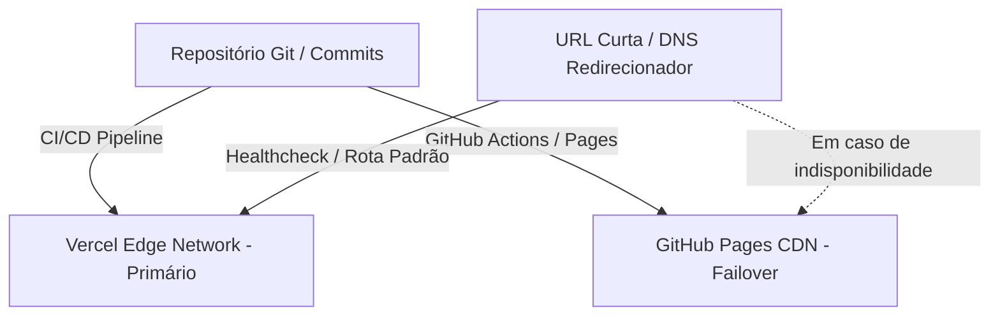

# Landing Page Comercial & Showcase de Produtos — Loja de Piscinas

> **Plataforma Web E-Commerce/Showcase de Alta Performance, Redundância Multi-Nuvem e Custo Operacional Zero.**  
> 🌐 **Demonstração Online (Live Demo):** [splashhortolandia.vercel.app](https://splashhortolandia.vercel.app/)

---

## 1. Visão Geral do Projeto (Estudo de Caso)

Este estudo de caso documenta a arquitetura e o desenvolvimento de uma **Landing Page Comercial e Catálogo Interativo** voltado para o setor de piscinas e produtos de lazer, acessível em produção através do endereço [splashhortolandia.vercel.app](https://splashhortolandia.vercel.app/). A solução foi concebida para entregar alta velocidade de carregamento, experiência visual imersiva (*rich UI/UX*) e resiliência de disponibilidade por meio de uma infraestrutura com **redundância multi-nuvem**, operando sob **custo operacional zero** (Zero-Cost Hosting Architecture).

---

## 2. Arquitetura de Deploy & Redundância Multi-Nuvem

A aplicação utiliza um pipeline de entrega contínua (CI/CD) integrado ao GitHub, publicando alterações simultaneamente em dois provedores independentes de hospedagem estática com estratégia de comutação por falha (failover):



### Destaques de Infraestrutura:
- **Deploy Duplo Automatizado:** Cada `git push` ativa atualizações simultâneas na **Vercel** (borda de alta velocidade) e no **GitHub Pages** (espelho de contingência).
- **Roteamento Resiliente com Failover:** Utilização de encurtador/DNS intermediário configurado com regra de tolerância a falhas. Caso o nó primário (Vercel) enfrente oscilações, o tráfego é desviado transparentemente para a CDN secundária do GitHub Pages.
- **Eficiência Financeira:** Operação 100% gratuita alavancando os tiers estáticos de alta performance de ambas as plataformas.

---

## 3. Engenharia Front-End & Desempenho

### 3.1 Gestão Local de Ativos & Tipografia (Zero External Dependency)
- **Subsets Tipográficos WOFF2:** Hospedagem local da família tipográfica *Montserrat* (pesos 100 a 900) em formato `WOFF2` altamente comprimido, eliminando requisições externas para provedores como Google Fonts, mitigando riscos de privacidade (GDPR/LGPD) e prevenindo o bloqueio de renderização (FOIT/FOUT).
- **Assets de Mídia Otimizados:** Galeria de produtos tratada em formatos leves (`WebP` / `PNG`) acompanhada de plano de fundo em vídeo comprimido (`gotas.mp4`) para reforçar a identidade temática aquática.

### 3.2 Catálogo Dinâmico Orientado a Dados (JSON Data-Driven)
- **Desacoplamento de Conteúdo:** O catálogo de piscinas e produtos é gerido externamente no arquivo `products.json`, permitindo atualização de modelos, fotos e descrições sem necessidade de alteração no código estrutural HTML.
- **Script de Manutenção de Dados:** Utilitário em Python (`scripts/update_products.py`) responsável pelo parsing, validação e atualização automatizada da base de dados JSON.

### 3.3 SEO Técnico & Conformidade Web
- **Auditoria de Mecanismos de Busca:** Indexação configurada com `sitemap.xml` dinâmico, diretivas de rastreamento em `robots.txt` e arquivo de verificação de propriedade do Google Search Console.
- **HTML5 Semântico:** Estrutura otimizada e responsiva para diferentes densidades de tela (Mobile, Tablet e Desktop).

---

## 4. Estrutura Modular da Aplicação

```text
splash-links/
├── fonts/                 # Subsets locais otimizados da fonte Montserrat (WOFF2)
├── images/                # Galeria do carrossel, texturas WebP e backgrounds
├── scripts/
│   └── update_products.py # Script Python para gerenciamento do catálogo de produtos
├── index.html             # Estrutura semântica principal da landing page
├── products.json          # Dataset JSON desacoplado com informações dos produtos
├── scripts.js             # Lógica interativa do carrossel e manipulação de DOM
├── styles.css             # Design system, animações CSS e media queries
├── robots.txt & sitemap.xml # Otimizações técnicas de SEO e indexação
└── vercel.json            # Configuração de rotas e cabeçalhos de borda da Vercel
```

---

## 5. Palavras-Chave & Tecnologias (Tech Stack)

| Categoria | Tecnologias / Conceitos |
|---|---|
| **Front-End Core** | `HTML5 Semântico`, `CSS3 (Animações & Flexbox/Grid)`, `JavaScript Vanilla (ES6+)` |
| **Infraestrutura & DevOps** | `Vercel Edge Network`, `GitHub Pages`, `Multi-Cloud Failover`, `CI/CD Automation` |
| **Performance & UI/UX** | `Self-Hosted Fonts (WOFF2)`, `Media Optimization (WebP/MP4)`, `Data-Driven UI (JSON)` |
| **SEO & Indexação** | `Technical SEO`, `Sitemap.xml`, `Robots.txt`, `Google Search Console Verification` |
| **Automação de Dados** | `Python 3 (Data Maintenance Script)` |
