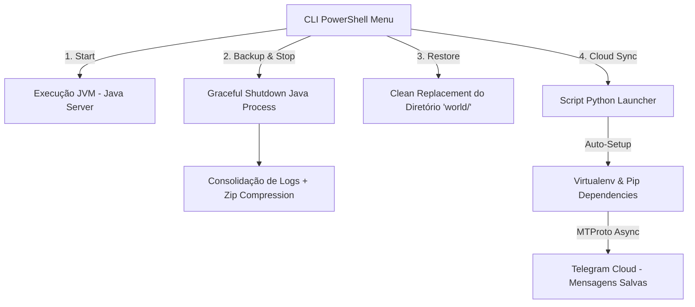

# Automação de Servidor Minecraft Java & Disaster Recovery via Telegram

> **Orquestrador de Servidor Dedicado, Gestão de Ciclo de Vida e Offsite Backup Automatizado na Nuvem.**

---

## 1. Visão Geral do Projeto

Este projeto consiste em uma solução de automação de infraestrutura leve para servidores dedicados de **Minecraft Java Edition** (Vanilla, Paper, Spigot). A aplicação resolve os desafios operacionais de execução contínua, prevenindo perda de dados por corrupção de mundo através de rotinas automatizadas de *graceful shutdown*, consolidação de logs, compactação temporal e sincronização de backups em armazenamento redundante em nuvem usando a API MTProto do Telegram.

A arquitetura combina **PowerShell** para controle do ambiente nativo Windows e **Python (Asyncio/Telethon)** para comunicação assíncrona e transferência de arquivos com serviços em nuvem.

---

## 2. Funcionalidades Principais

- **Inicialização Dinâmica de Servidor:** Detecção e execução automática da versão mais recente dos binários JAR (`paper*.jar`, `server*.jar`) com alocação otimizada de memória JVM.
- **Graceful Shutdown & Preservação de Estado:** Finalização segura dos processos da máquina virtual Java (`java.exe`) antes de qualquer escrita no disco, garantindo a integridade transacional do diretório do mundo (`world/`).
- **Consolidação de Logs & Compactação de Backup:** Cópia defensiva dos arquivos de log operacionais (`latest.log`) e criação de arquivos compactados `.zip` indexados por *timestamp* (`YYYY-MM-DD-HH-mm-ss`).
- **Disaster Recovery (Restauração Instantânea):** Mecanismo de roll-back automatizado que substitui com segurança o diretório do mundo ativo pelo último ponto de restauração disponível.
- **Offsite Backup na Nuvem (Telegram Cloud):** Envio assíncrono do arquivo de backup para o Telegram através do protocolo MTProto, servindo como repositório remoto redundante de alta disponibilidade.
- **Auto-Provisionamento de Ambiente Virtual (Self-Bootstrapping Venv):** O módulo Python gerencia autonomamente a criação do seu ambiente virtual (`venv`), instalação automatizada de dependências via `pip` e re-execução isolada sem necessidade de setup manual.

---

## 3. Arquitetura da Solução



### 3.1 Camada de Orquestração (PowerShell CLI)
O script de controle primário em PowerShell fornece uma interface de terminal (CLI) para gerenciamento do servidor:
- **Detecção de Recursos:** Mapeia dinamicamente os arquivos JAR presentes na raiz usando filtros de expressão regular e ordenação por data de modificação (`LastWriteTime`).
- **Gestão de Processos:** Monitora e interrompe processos ativos com tratamento de exceções e intervalos de segurança para descarregamento de buffer de E/S do disco.
- **Tratamento UTF-8:** Configura a codificação do console Windows (`chcp 65001` e `[Console]::OutputEncoding`) prevenindo corrupção visual em saídas de terminal.

### 3.2 Camada de Comunicação & Nuvem (Python / Telethon)
O componente secundário em Python trata a sincronização remota de dados:
- **Autenticação Segura & Sessão SQLite:** Persiste a sessão do Telegram utilizando `SQLiteSession` de forma local e segura.
- **Transmissão Assíncrona & Telemetria:** Utiliza corrotinas `asyncio` e callbacks para reportar progresso de envio em tempo real no console (volume transferido e percentual).
- **Self-Bootstrapping:** Padrão arquitetural onde o script valida seu próprio ambiente de execução (`sys.prefix == sys.base_prefix`), criando o `venv` e instalando pacotes (`telethon`, `setuptools`) antes de utilizar `os.execv` para se reinicializar dentro do ambiente isolado.

---

## 4. Abstração da Lógica Operacional

### Fluxo Operacional de Backup & Preservação (PowerShell)
```powershell
# 1. Interrupção graciosa do processo Java em execução
if (Get-Process -Name java -ErrorAction SilentlyContinue) {
    Stop-Process -Name java -Force
    Start-Sleep -Seconds 5
}

# 2. Consolidação de logs de auditoria no diretório do mundo
Copy-Item -Path "logs/latest.log" -Destination "world/logs/" -Force

# 3. Compactação do diretório de estado em arquivo ZIP temporal
Compress-Archive -Path "world" -DestinationPath "backups/world-YYYY-MM-DD-HH-mm-ss.zip" -Force
```

### Fluxo de Auto-Provisionamento e Re-execução (Python)
```python
def restart_in_venv():
    # Criação transparente do ambiente virtual e instalação de pacotes requeridos
    if not VENV_DIR.exists():
        venv.create(VENV_DIR, with_pip=True)
        subprocess.check_call([python_executable, "-m", "pip", "install", "telethon", "setuptools"])
    
    # Substituição do processo atual pelo interpretador Python do venv
    os.execv(str(python_executable), [str(python_executable)] + sys.argv)
```

---

## 5. Palavras-Chave & Tecnologias (Tech Stack)

| Categoria | Tecnologias / Conceitos |
|---|---|
| **Linguagens & Scripts** | `PowerShell 7+`, `Python 3.10+`, `Win32 CLI Automation` |
| **Automação & Cloud API** | `Telethon (MTProto API)`, `Telegram Cloud Storage`, `Asyncio` |
| **DevOps & Infraestrutura** | `Disaster Recovery`, `Graceful Shutdown`, `Process Management`, `Log Aggregation` |
| **Arquitetura de Software** | `Self-Bootstrapping Virtualenv`, `CLI Orchestration`, `State Persistence` |
| **Utilitários OS** | `Compress-Archive (ZIP)`, `UTF-8 Encoding`, `Process Intercept` |

---

## 6. Como Executar

### Pré-requisitos
- **Windows OS** com PowerShell 5.1+ / 7+
- **Java Runtime Environment (JRE/JDK 17+)** configurado nas variáveis de ambiente.
- **Python 3.8+** instalado.
- Credenciais da API do Telegram (`api_id` e `api_hash`) obtidas no portal [my.telegram.org](https://my.telegram.org).

### Execução
1. Mantenha os scripts no diretório raiz do seu servidor Minecraft Java.
2. Inicie o orquestrador via terminal:
   ```powershell
   .\gerenciador-servidor.ps1
   ```
3. Utilize o menu interativo para operar o servidor e realizar backups locais ou em nuvem.