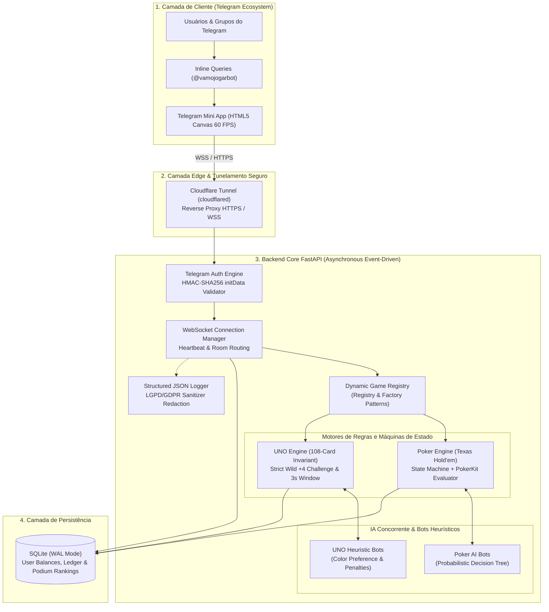

# Estudo de Caso: Telegram Games Hub — Plataforma Distribuída de Jogos Multiplayer em Tempo Real (TMA)

> **Plataforma de entretenimento multiplayer de alta performance no ecossistema Telegram: Telegram Mini Apps (TMA Canvas 60 FPS), backend assíncrono orientado a eventos (Python 3.12 / FastAPI / WebSockets), autoridade estrita do servidor (Anti-Cheat) e autenticação criptográfica HMAC-SHA256.**  
> **Bot & Mini App (Live):** [@vamojogarbot (t.me/vamojogarbot)](https://t.me/vamojogarbot)

---

## 1. Contexto e Objetivo

Jogos multiplayer móveis tradicionais frequentemente sofrem com fricções de adoção: necessidade de downloads pesados de lojas de aplicativos, fluxos burocráticos de criação de contas, pareamento demorado de salas e vulnerabilidades a trapaças (*cheats*) quando a lógica de regras reside no cliente.

O **Telegram Games Hub (`@vamojogarbot`)** foi concebido para eliminar completamente essas barreiras através da integração nativa com os **Telegram Mini Apps (TMA)** e uma arquitetura reativa em tempo real baseada em **WebSockets**. A plataforma permite que múltiplos usuários disputem partidas síncronas de **Pôquer Texas Hold'em** e **UNO** diretamente em conversas privadas ou grupos, sem qualquer instalação externa e com carregamento em menos de 2 segundos.

### Objetivos Centrais de Engenharia:
- **Baixa Latência e Sincronização em Tempo Real:** Manter estado compartilhado ultra-síncrono entre múltiplos clientes sob conexões móveis instáveis (3G/4G/5G).
- **Autoridade Estrita do Servidor (*Server-Authoritative State*):** Garantir que cartas ocultas de adversários nunca transitem no payload de rede para clientes não-autorizados, eliminando manipulação no frontend.
- **Extensibilidade e Baixo Acoplamento (SOLID):** Implementar o padrão *Registry Pattern* com descritores desacoplados, permitindo acoplar novos jogos (Truco, Xadrez, Dominó) sem refatorar o núcleo de rede e autenticação.
- **Renderização Gráfica a 60 FPS:** Renderizar feltro, animações de cartas, fichas e feedback tátil através de HTML5 Canvas e Web Audio API sem bibliotecas pesadas de terceiros.
- **Segurança Criptográfica & Observabilidade:** Validação de identidade via HMAC-SHA256, sanitização LGPD/GDPR de logs e alertas inteligentes em tempo real no Telegram para a administração.

---

## 2. Tecnologias e Ferramentas Utilizadas

| Camada / Componente | Tecnologia | Papel no Projeto |
|---|---|---|
| **Linguagem & Backend** | Python 3.12, FastAPI (Assíncrono / ASGI), Uvicorn | Núcleo reativo orientado a eventos e orquestração de WebSockets |
| **Integração Telegram** | aiogram 3 (Bot API), Telegram Mini Apps SDK | Comandos inline (`@vamojogarbot`), deep linking e validação HMAC-SHA256 |
| **Motores de Jogos** | PokerKit, Motores Customizados de Regras | Máquinas de estado (FSM), avaliação combinatorial e equivalência de mãos |
| **Validação & Schemas** | Pydantic v2, Dataclasses tipadas | Serialização ultrarrápida de payloads de rede e tipagem estática estrita |
| **Gerenciador de Pacotes** | Astral `uv` | Resolução determinística e ambiente virtual de alta velocidade |
| **Persistência de Dados** | SQLite em Modo WAL (*Write-Ahead Logging*) | Transações ACID concorrentes para saldos, histórico e rankings |
| **Frontend Webview (TMA)** | HTML5 Canvas API, Vanilla JS (ES6+), CSS3 Hardware-Accelerated | Renderização procedural a 60 FPS, Web Audio API e Haptic Feedback |
| **DevOps & Rede** | Docker, Docker Compose, Cloudflare Tunnels | Encapsulamento de contêineres e tunelamento seguro HTTPS / WSS |
| **Testes & Qualidade** | pytest, pytest-asyncio (73 testes automatizados) | Cobertura total de fluxos críticos, handshakes e invariâncias matemáticas |
| **Observabilidade** | Structured JSON Logging, Grafana/Loki Ready | Logs estruturados one-per-line e alertas com throttling no Telegram |

---

## 3. Arquitetura do Sistema e Fluxo de Execução

A arquitetura desacopla a camada de cliente (TMA Canvas), o túnel de comunicação segura e o núcleo de orquestração de salas e motores de regras:

### Padrões de Projeto e Decisões de Arquitetura:
1. **Registry Pattern & Factory Method:** O módulo `GameRegistry` gerencia descritores de jogos desacoplados. Cada motor (`PokerEngine`, `UnoEngine`) implementa sua máquina de estados, regras e IAs de forma isolada, sendo instanciado dinamicamente a partir do prefixo da sala (`pk_` ou `uno_`).
2. **Deterministic URLs & Lazy Initialization:** Links de salas são gerados de forma síncrona e determinística (`uuid4`), e a máquina de estados do jogo no servidor só é alocada na memória quando o primeiro jogador se conecta via WebSocket, economizando recursos de infraestrutura.
3. **State Masking & Anti-Cheat:** Antes de qualquer broadcast WebSocket, o estado global da mesa é filtrado por jogador. Cada socket recebe apenas as suas cartas privadas e as informações públicas da mesa (cartas comunitárias / descarte).
4. **IA Concorrente e Decisões Heurísticas:** Bots inteligentes integrados (`Ruby`, `Blaze`, `Volt`, `Azure`) simulam o comportamento humano com *delays* configuráveis para preenchimento de mesas e testes de estresse.

---

## 4. Destaques dos Motores de Jogo

### 4.1 Motor de Pôquer (Texas Hold'em)
- **Máquina de Estados Finita (FSM):** Controle estrito do ciclo de apostas:
  $$\text{PREFLOP} \longrightarrow \text{FLOP} \longrightarrow \text{TURN} \longrightarrow \text{RIVER} \longrightarrow \text{SHOWDOWN} \longrightarrow \text{PAYOUT}$$
- **Suporte a Regras Avançadas:** Gestão de blinds (Small/Big Blind), potes divididos (*split pots*), potes paralelos (*side pots* para múltiplos *all-ins*), cálculo dinâmico de probabilidades e desempate automático via `pokerkit`.
- **Proteção de Hole Cards:** Cartas da mão são transmitidas apenas para o socket autenticado do respectivo jogador, mascarando as cartas de adversários até o momento do *Showdown*.

### 4.2 Motor de UNO Avançado
- **Invariante Físico de 108 Cartas:** O motor audita a conservação exata das 108 cartas (mãos de jogadores + pilha de compra + pilha de descarte) a cada ação, impedindo duplicações ou sumiço de cartas mesmo após múltiplos reembaralhamentos.
- **Regra Oficial Estrita do Curinga +4:** O servidor valida se o jogador possui cartas da cor corrente da mesa antes de aceitar o +4, reproduzindo o desafio oficial de contestação do UNO.
- **Janela de Tolerância de 3 Segundos para o Grito de UNO:** Temporizador assíncrono no servidor que penaliza o jogador com +2 cartas se ele ficar com 1 carta e não declarar "UNO!" a tempo.
- **Modo Ranking Completo:** A partida continua após o 1º lugar até determinar todas as posições do pódio (2º, 3º e 4º lugares), computando histórico detalhado no banco de dados.

---

## 5. Segurança, Observabilidade e Testes

- **Validação Criptográfica HMAC-SHA256:** Validação do hash do `initData` gerado pela chave secreta do bot do Telegram, impedindo falsificação de identidade de usuário (*identity spoofing*).
- **Sanitização LGPD/GDPR:** Interceptor automático no pipeline de logs que redige senhas, tokens de bot, chaves de API e `initData` brutos com `[REDACTED]`.
- **Alertas Inteligentes ao Administrador:** Erros de nível `ERROR` e `CRITICAL` disparam alertas em HTML no Telegram do Super Admin, com agrupamento (*debounce/throttling*) para evitar spam em caso de falhas em cascata.
- **73 Testes Automatizados (pytest / pytest-asyncio):**
  - Validação do handshake HMAC com dados legítimos e payloads adulterados;
  - Testes estocásticos de invariância matemática do baralho de 108 cartas em 100 rodadas sucessivas;
  - Simulação de desconexões abruptas de rede, turn timeouts e all-in múltiplo em potes fracionados.

---

## 6. Principais Resultados e Métricas

- **Zero-Install Instantâneo:** Entrada em partidas em menos de **2 segundos** através de links inline compartilhados em grupos.
- **Eficiência de Recursos:** Frontend leve em Vanilla JS + Canvas eliminou o overhead de frameworks pesados (React/Vue), garantindo 60 FPS mesmo em smartphones de entrada.
- **Arquitetura 100% Extensível:** A introdução do motor de UNO foi realizada plugando novas classes no `GameRegistry`, comprovando o princípio Aberto/Fechado (SOLID) sem quebrar o módulo de Pôquer pré-existente.