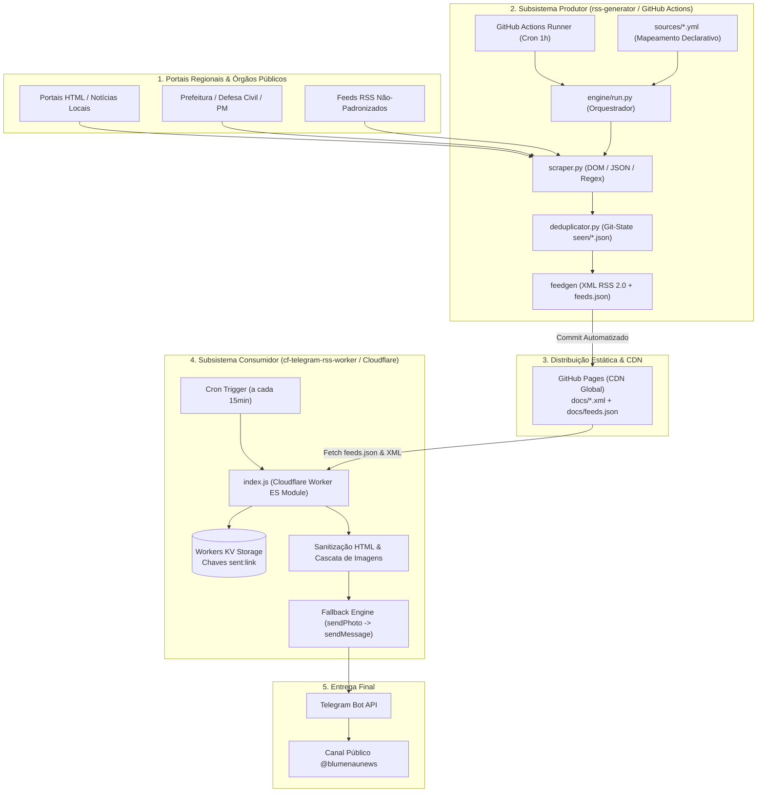

# Estudo de Caso: Pipeline Serverless de Ingestão, Normalização RSS e Distribuição de Notícias no Telegram

> **Arquitetura desacoplada em dois subsistemas integrados: Gerador RSS GitOps (Python / GitHub Actions / GitHub Pages) e Consumidor Edge Serverless (Cloudflare Workers / Workers KV) para curadoria e transmissão de notícias em tempo real.**  
> **Canal Telegram (Live):** [@blumenaunews (t.me/blumenaunews)](https://t.me/blumenaunews)

---

## 1. Contexto e Objetivo

A cobertura informativa de âmbito regional frequentemente sofre com a fragmentação de canais de comunicação. Órgãos públicos municipais (Defesa Civil, Polícia Militar, SAMAE, Prefeitura e Câmara Municipal) e portais de jornalismo local possuem estruturas heterogêneas de publicação: a maioria não disponibiliza feeds RSS/Atom padronizados, utiliza sistemas proprietários de *lazy-loading* de imagens ou expõe endpoints inconsistentes.

Para solucionar esse problema e entregar notícias em tempo real para a comunidade sem incorrer em custos com servidores dedicados 24/7, foi desenvolvida uma **solução de engenharia em dois subsistemas complementares e desacoplados**:

1. **Subsistema Produtor (`rss-generator`):** Pipeline em Python que monitora, faz *scraping*, normaliza datas e metadados e compila feeds RSS 2.0 e catálogos JSON estáticos sob o paradigma *GitOps / Flat-File*.
2. **Subsistema Consumidor (`cf-telegram-rss-worker`):** *Worker serverless* distribuído na borda (*edge computing*) da Cloudflare, acionado por gatilhos temporais (*Cron Triggers*), que realiza deduplicação atômica em chave-valor (Workers KV), sanitização de texto e despacho automatizado para o canal do Telegram via Telegram Bot API.

---

## 2. Tecnologias e Ferramentas Utilizadas

| Camada / Módulo | Tecnologia | Aplicação no Estudo de Caso |
|---|---|---|
| **Ingestão & Scraping** | Python 3.12, BeautifulSoup4, Requests, lxml | Coleta polimórfica (HTML DOM, REST JSON e passthrough RSS) |
| **Geração de Feeds** | feedgen, python-dateutil, PyYAML | Criação de feeds RSS 2.0 válidos, enclosures e parsing flexível de datas em PT-BR |
| **Orquestração GitOps** | GitHub Actions (Cron 1h), Git-as-Database | Automação de execução por cron e persistência de estado via commits automatizados |
| **Distribuição de Feeds** | GitHub Pages (CDN Global) | Hospedagem estática de arquivos XML e catálogo central `feeds.json` |
| **Runtime Edge** | Cloudflare Workers (JavaScript ES Modules) | Execução serverless do consumidor na borda com tempo de inicialização nulo (0ms cold start) |
| **Armazenamento de Estado Edge** | Cloudflare Workers KV | Banco chave-valor global para deduplicação atômica e controle de throttling |
| **Agendamento Edge** | Cloudflare Cron Triggers (`*/15 * * * *`) | Disparo periódico a cada 15 minutos |
| **Mensageria & Entrega** | Telegram Bot API (`sendPhoto` / `sendMessage`) | Envio formatado de fotos e legendas HTML com fallbacks de rede |

---

## 3. Arquitetura Integrada da Solução

O fluxo operacional conecta a coleta dos portais de origem até o envio aos assinantes no Telegram através de uma esteira assíncrona orientada a eventos e arquivos estáticos:



---

## 4. Detalhamento dos Subsistemas

### 4.1 Subsistema 1: Produtor de Feeds (`rss-generator`)

O `rss-generator` é estruturado sobre o paradigma *Config-Driven*: nenhuma fonte de notícia requer código Python novo; novas origens são integradas através de arquivos declarativos YAML em `sources/*.yml`.

- **Coleta Polimórfica:**
  - `scrape_page`: Extrai itens de páginas HTML via seletores CSS configuráveis (`items`, `title`, `link`, `date`, `summary`, `image`).
  - `fetch_json`: Consome endpoints REST, navegando em propriedades aninhadas via notação de ponto (`json_items_path`).
  - `fetch_rss`: Executa passthrough de feeds RSS/Atom pré-existentes aplicando filtros de palavras-chave.
- **Detecção Inteligente de Imagens e Fallbacks:** Suporta atributos de *lazy loading* (`data-src`, `data-original`), extração de regras CSS `background-image: url(...)` e fallback automático para metatags OpenGraph (`og:image`, `og:description`) ao visitar a página do artigo quando a listagem não traz thumbnail.
- **Normalização Temporal em Português:** Limpeza de preposições (*"publicado em"*, *"às"*), tradução automática de meses para inglês e anexo do offset de fuso horário UTC.
- **Persistência via Git-as-Database:** O histórico de URLs já processadas é gravado em `state/seen/<source_id>.json` e commitado pelo runner do GitHub Actions com `[skip ci]`. Uma política de rotação limita o histórico a 500 registros por fonte, evitando consumo excessivo de armazenamento.

---

### 4.2 Subsistema 2: Consumidor Edge Serverless (`cf-telegram-rss-worker`)

O `cf-telegram-rss-worker` é executado na rede *edge* global da Cloudflare, garantindo latência mínima e processamento não-bloqueante via `ctx.waitUntil(...)`.

- **Carga Dinâmica de Feeds:** O worker lê a lista centralizada de fontes publicadas no catálogo JSON do GitHub Pages, permitindo alterar a lista de portais monitorados sem necessidade de recompilação do worker.
- **Deduplicação Atômica com Workers KV:** Cada item coletado é consultado no banco chave-valor sob a chave `sent:<link>`. Se o registro existir, o item é ignorado instantaneamente sem gastar chamadas da API do Telegram. Caso seja inédito, a chave é gravada no KV com timestamp.
- **Cascata de Captura de Mídia:** Avalia sequencialmente tags `<media:content>`, `<enclosure>`, tags `` no corpo HTML e aplica normalização de caminhos relativos para absolutos.
- **Sanitização Rigorosa e Limites do Telegram:** Realiza escape de caracteres reservados (`&`, `<`, `>`) e trunca a descrição parametricamente para respeitar com folga o limite de 1.024 caracteres da legenda de imagens no Telegram.
- **Fallback Automático de Envio:** Caso o envio via `sendPhoto` retorne erro (ex: link de imagem quebrado ou bloqueado por hotlink no portal de origem), o worker captura a falha e reenvia instantaneamente via `sendMessage` apenas com o texto sanitizado, prevenindo perda de notícias.
- **Controle de Throttling (`MAX_ITEMS_PER_RUN`):** Limite configurado de até 3 notícias por ciclo de 15 minutos para evitar *flood* e sobrecarga no canal.

---

## 5. Operação, Observabilidade e CI/CD

```
┌─────────────────────────────────────────────────────────────┐
│ Pipeline CI/CD 1: rss-generator                             │
│ GitHub Actions Cron (0 * * * *) ──► Python Engine           │
│ ──► Commit state/seen/ & docs/ ──► Deploy no GitHub Pages   │
└─────────────────────────────────────────────────────────────┘

┌─────────────────────────────────────────────────────────────┐
│ Pipeline CI/CD 2: cf-telegram-rss-worker                    │
│ Push na branch main ──► GitHub Actions                      │
│ ──► Wrangler CLI Deploy ──► Cloudflare Edge (Workers + KV)  │
└─────────────────────────────────────────────────────────────┘
```

- **Observabilidade HTTP:** O Cloudflare Worker expõe endpoints de diagnóstico:
  - `GET /health` — Status de saúde do serviço (`{"ok": true, "status": "healthy"}`).
  - `GET /list-feeds` — Listagem em tempo real das fontes carregadas a partir da URL remota.
  - `GET /test-run` — Execução em modo de teste (força o envio de 1 notícia não vista e retorna log detalhado com itens coletados, enviados e ignorados).
- **Segurança de Credenciais:** Tokens sensíveis (`TELEGRAM_BOT_TOKEN`, `TELEGRAM_CHAT_ID`) são isolados no cofre de segredos da Cloudflare (*Encrypted Environment Secrets*).

---

## 6. Principais Resultados e Benefícios

- **Custo Operacional Zero:** Arquitetura 100% contida dentro dos planos gratuitos do GitHub (Actions e Pages) e da Cloudflare (Workers e KV).
- **Alta Resiliência e Autonomia:** Tolerância a falhas de rede, links de imagem quebrados e formatos de data despadronizados sem intervenção manual.
- **Desacoplamento e Baixo Acoplamento:** O gerador de feeds não conhece os consumidores, e o consumidor edge não depende da infraestrutura dos portais de notícias de origem.
- **Performance de Borda:** Processamento por ciclo tipicamente inferior a 1–2 segundos com distribuição global pela CDN.