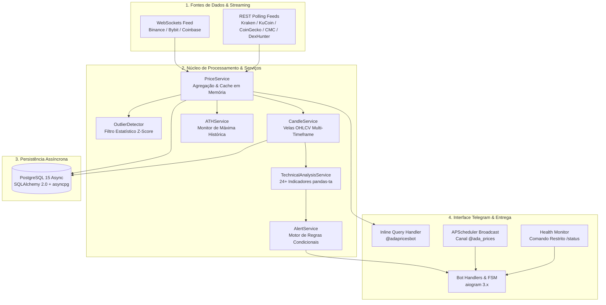

# Estudo de Caso: ADA Prices Bot — Agregação de Preços, Análise Técnica e Alertas em Tempo Real

> **Sistema assíncrono em Python 3.11 para agregação multi-fonte (CEXs/DEXs), detecção estatística de anomalias via Z-Score, cálculo de 24+ indicadores técnicos (pandas-ta) e entrega via Telegram com suporte a 9 idiomas (incluindo RTL).**  
> 🤖 **Bot Online no Telegram (Live):** [@adapricesbot (t.me/adapricesbot)](https://t.me/adapricesbot)

---

## 1. Contexto e Objetivo

No ecossistema de criptoativos da Cardano (ADA), a fragmentação de liquidez entre exchanges centralizadas (CEXs) e formadores automáticos de mercado descentralizados (DEXs) gera discrepâncias temporárias de preços, *spreads* voláteis e riscos de *flash crashes* locais.

O **ADA Prices Bot** (disponível publicamente via [@adapricesbot](https://t.me/adapricesbot)) foi projetado e implementado como uma plataforma assíncrona orientada a eventos para:
- Consolidar feeds de preços contínuos de **8 provedores simultâneos** via WebSockets de baixa latência e REST resiliente.
- Filtrar *outliers* estatísticos e anomalias de mercado através de algoritmo **Z-Score / Modified Z-Score**.
- Calcular séries temporais e **velas OHLCV** (`1m`, `5m`, `15m`, `1h`, `4h`, `1d`) em tempo real.
- Executar um motor quantitativo com **mais de 24 indicadores de análise técnica** para alimentar um construtor de alertas condicionais personalizados.
- Entregar respostas instantâneas via **Telegram Inline Mode**, canal público automatizado e comandos interativos, com suporte nativo a **9 idiomas** (incluindo suporte a caracteres bidirecionais para idiomas RTL como Árabe e Hebraico).
- Operar **24/7 com custo zero de infraestrutura**, através de controle rigoroso de recursos e políticas de *hardening* em container Docker na Oracle Cloud Infrastructure (OCI).

---

## 2. Tecnologias e Ferramentas Utilizadas

| Camada / Componente | Tecnologia | Aplicação no Projeto |
|---|---|---|
| **Linguagem & Runtime** | Python 3.11 (Asyncio) | Concorrência cooperativa, tipagem estática e baixa sobrecarga de CPU/memória |
| **Framework Telegram** | aiogram 3.25 | Handlers assíncronos, gerenciamento de estado FSM e suporte a Inline Queries |
| **Data Engine & Análise** | pandas 2.2, pandas-ta, numpy 1.26 | Processamento vetorizado de séries temporais e cálculo de indicadores técnicos |
| **Banco de Dados** | PostgreSQL 15 (Alpine) / SQLite | Persistência relacional de histórico de velas, regras de alertas e telemetria |
| **ORM & Migrações** | SQLAlchemy 2.0 Async, Alembic | Mapeamento declarativo assíncrono via `asyncpg` / `aiosqlite` com índices compostos |
| **Comunicação de Rede** | aiohttp 3.9, websockets 12, tenacity | Streaming bidirecional, pooling HTTP e circuit breaker com backoff exponencial |
| **Agendamento** | APScheduler 3.10 | Tarefas cron em background para broadcast em canais e expurgo de dados obsoletos |
| **Observabilidade** | structlog, psutil | Logs estruturados em JSON com mascaramento de dados sensíveis e monitor `/status` |
| **Infraestrutura & Deploy** | Docker, Docker Compose, GHCR, OCI | Containerização hardened (read-only), cotas de memória e CI/CD via GitHub Actions |

---

## 3. Arquitetura da Solução e Fluxo de Dados



---

## 4. Componentes Principais e Engenharia do Sistema

### 4.1 Ingestão Híbrida de Preços (WebSockets + REST)
- **Streamers Persistentes:** Conexões WebSockets dedicadas mantêm o livro de ofertas atualizado a cada *tick* de mercado com reconexão automática exponencial e detecção de *heartbeat* (ping/pong).
- **Provedores REST Resilientes:** Provedores de contingência e DEXs locais (DexHunter) operam sob *polling* assíncrono com semáforos de concorrência (`asyncio.Semaphore`) e reintetativas estruturadas via `tenacity`.

### 4.2 Detecção Estatística de Anomalias (Z-Score)
Para evitar que cotações manipuladas, travamentos em nós de validação ou discrepâncias de liquidez distorçam a média global do ativo:
- O módulo `OutlierDetector` calcula o desvio padrão e o Z-Score das cotações coletadas em cada janela temporal.
- Cotações que excedem o limiar configurado (`OUTLIER_THRESHOLD`) são descartadas do cálculo da média consolidada e registradas na tabela de auditoria `outlier_alerts`.

### 4.3 Agregação e Persistência de Velas OHLCV
- O `CandleService` processa fluxos contínuos de preços e consolida velas em tempo real nos tempos gráficos `1m`, `5m`, `15m`, `1h`, `4h` e `1d`.
- Índices únicos compostos (`uq_candle_symbol_timeframe_timestamp`) asseguram integridade transacional sem duplicações.

### 4.4 Motor Quantitativo de Análise Técnica e Alertas
O `TechnicalAnalysisService` avalia mais de 24 indicadores técnicos calculados sobre matrizes numéricas com `pandas-ta`:
- **Tendência:** SMA, EMA, MACD, ADX, Ichimoku Cloud, Parabolic SAR.
- **Momento:** RSI, Stochastic (%K, %D e cruzamentos), CCI, ROC, Williams %R, Awesome Oscillator.
- **Volatilidade:** Bandas de Bollinger, ATR, NATR, Canais de Keltner, Canais de Donchian.
- **Volume:** OBV, MFI, CMF, A/D, Oscilador Chaikin, VWAP, Ease of Movement, Klinger.
- **Alertas Compostos:** Permite ao usuário definir regras lógicas complexas no Telegram (ex: `ADA/USDT > 1.25 E RSI(14, 1h) > 70`) acionadas via FSM interativa.

### 4.5 Internacionalização e Suporte RTL (Right-to-Left)
- Localização completa em 9 idiomas: Português (`pt`), Inglês (`en`), Espanhol (`es`), Francês (`fr`), Japonês (`ja`), Swahili (`sw`), Hausa (`ha`), Árabe (`ar`) e Hebraico (`he`).
- Algoritmo de injeção de marcadores direcionais Unicode (`\u202A` - LRE e `\u202C` - PDF) para isolar valores numéricos e símbolos de pares cambiais em interfaces RTL, evitando corrupção de layout visual.

---

## 5. Infraestrutura, Deploy e Hardening

```
┌──────────────────────────────────────────────────────────┐
│                   Oracle Cloud (OCI)                     │
│                  Always Free Compute VM                  │
│                                                          │
│  ┌───────────────────────┐    ┌───────────────────────┐  │
│  │   ada_prices_bot      │    │     ada_prices_db     │  │
│  │  (Python 3.11 App)    │◄──►│  (PostgreSQL 15 Alp)  │  │
│  │  RAM: 256MB ~ 600MB   │    │  RAM: 64MB ~ 128MB    │  │
│  │  Hardened Read-Only   │    │  Persistent Volume    │  │
│  └───────────────────────┘    └───────────────────────┘  │
│              ▲                                           │
│              │ SSH Deploy / Docker Compose               │
└──────────────┼───────────────────────────────────────────┘
               │
   ┌───────────┴───────────┐
   │    GitHub Actions     │  Push na branch main
   │     (CI/CD Pipeline)  │  Build Dockerx + Push GHCR + SSH Deploy
   └───────────────────────┘
```

### Parâmetros de Hardening e Segurança:
1. **Sistema de Arquivos Read-Only:** Container do bot configurado com `read_only: true` e montagem em memória volátil `tmpfs` para `/tmp`.
2. **Privilégios Mínimos:** Execução sob usuário não-root `appuser` com `cap_drop: ALL` e `security_opt: no-new-privileges:true`.
3. **Cotas Rígidas de Memória:** Limite de 600MB de RAM (`mem_reservation: 256m`, `memswap_limit: 1000m`) e PostgreSQL sintonizado para baixo consumo (`shared_buffers=32MB`, `work_mem=4MB`).
4. **CI/CD Automatizado:** Pipeline GitHub Actions com compilação multi-arquitetura via Docker Buildx, publicação no GitHub Container Registry (`ghcr.io`) e acionamento via SSH na VPS Oracle Cloud.

---

## 6. Principais Resultados e Diferenciais Técnicos

- **Alta Precisão e Resiliência:** Agregação simultânea de 8 fontes de dados com eliminação automática de distorções e *outliers*.
- **Interatividade Instantânea:** Respostas sub-segundo no Telegram Inline Mode (`@adapricesbot`) sem sobrecarga no servidor.
- **Motor Analítico Embarcado:** Análise técnica institucional acessível diretamente pelo mensageiro em múltiplos tempos gráficos.
- **Zero Custo de Hospedagem:** Otimização de ciclo de vida e baixo consumo computacional viabilizando operação ininterrupta 24/7 na camada gratuita da nuvem.
